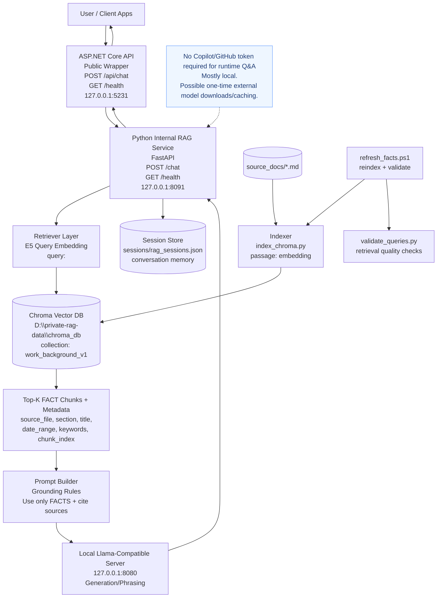

# Amin Personal Agent - End-to-End Architecture

```mermaid
flowchart TD
    U[User / Client Apps] --> ASP[ASP.NET Core API\nPublic Wrapper\nPOST /api/chat\nGET /health\n127.0.0.1:5231]

    ASP --> RAG[Python Internal RAG Service\nFastAPI\nPOST /chat\nGET /health\n127.0.0.1:8091]

    RAG --> RET[Retriever Layer\nE5 Query Embedding\nquery: <question>]
    RET --> CDB[(Chroma Vector DB\nD:\\private-rag-data\\chroma_db\ncollection: work_background_v1)]

    CDB --> FACTS[Top-K FACT Chunks + Metadata\nsource_file, section, title,\ndate_range, keywords, chunk_index]
    FACTS --> PROMPT[Prompt Builder\nGrounding Rules\nUse only FACTS + cite sources]

    PROMPT --> LLM[Local Llama-Compatible Server\n127.0.0.1:8080\nGeneration/Phrasing]
    LLM --> RAG
    RAG --> ASP
    ASP --> U

    RAG --> SESS[(Session Store\nsessions/rag_sessions.json\nconversation memory)]

    SRC[(source_docs/*.md)] --> IDX[Indexer\nindex_chroma.py\npassage: <chunk> embedding]
    IDX --> CDB

    REF[refresh_facts.ps1\nreindex + validate] --> IDX
    REF --> VAL[validate_queries.py\nretrieval quality checks]

    NOTE[No Copilot/GitHub token required for runtime Q&A\nMostly local.\nPossible one-time external model downloads/caching.]:::note
    NOTE -.-> RAG

    classDef note fill:#eef6ff,stroke:#6aa0ff,color:#1f3b73;
```
