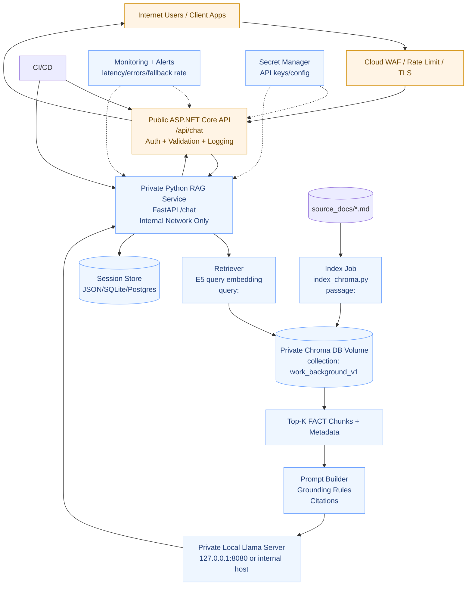

# Amin Personal Agent - Production / Online Deployment Architecture

## Notes
- Keep `RAG`, `Chroma`, and `LLM` private (not internet-exposed).
- Publicly expose only ASP.NET API behind TLS + auth + rate limiting.
- Continue using e5 prefixes (`passage:` for chunks, `query:` for questions).
- Run indexing as a controlled internal job after source updates.
